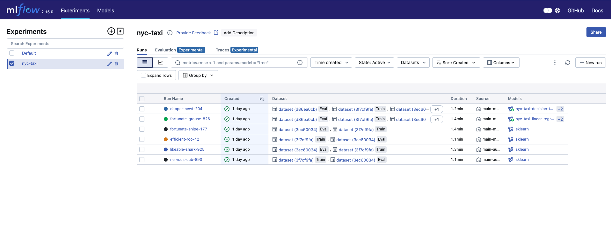
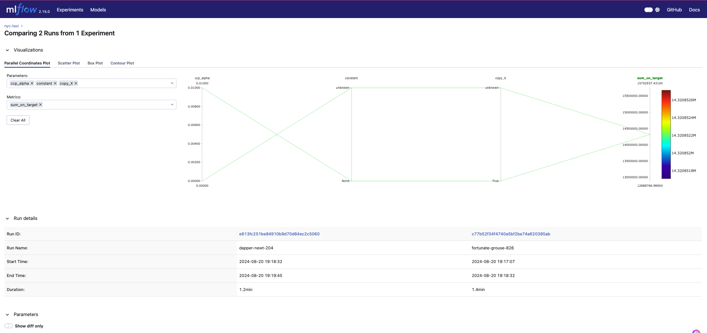
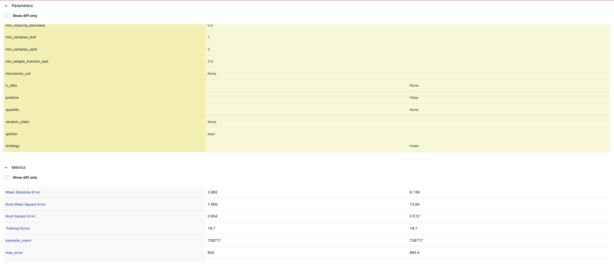
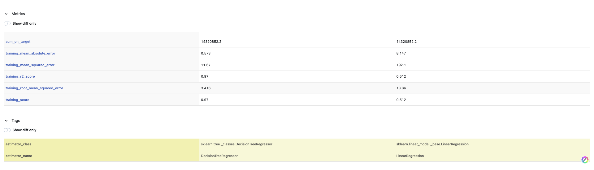

## NYC YELLOW TAXI TRIP FARE AMOUNT PREDICTION MODEL TRACKING WITH MLFLOW

This project uses MLFlow to track and register machine learning models for predicting fare amount of taxi ride. The dataset used for training this model is New York City taxi dataset which can be download [here](https://www.nyc.gov/site/tlc/about/tlc-trip-record-data.page).

This project uses two machine learning techniques which include Linear Regression and Decision Tree Regressor.

### Prerequisite
- Python
- Data Cleaning and Processing
- Correlation
- Regression
- MLflow

Python and Mlflow must be installed to be able to setup this project locally.

MLflow can be installed using belwo command

```
pip install mlflow
```


### Overview of Directories

This consist of three different folders. 

#### 1. general_utils
This directory is has the utility functions for processing data, cleaning data, training models as well as evaluating models.

#### 2. non-project-runs
This directory consists of three python files. Each of the python files train and track the ML models in different ways just to make use of the different components and functionalities of MLFlow.

Below are the files contained in this directory:

##### [main-autolog.py](non-project-runs/main-autolog.py)

This is the simplest which leverages the autolog function of MLflow to log models, metrics and parameters. It creates an experiment with the name nyc-taxi. This can be run using the command below

```
python main-autolog.py
```

##### [main-manual-model-log](non-project-runs/main-manual-model-log.py)

This also leverages the autolog function of MLflow but not used to log models. It creates an experiment with the name nyc-taxi, creates the model and manually log the model as well as artifact which include the correlation heat map.
This can be run using the command below

```
python main-manual-model-log.py
```


##### [main-manual-model-and-evaluation-with-threshold.py](non-project-runs/main-manual-model-and-evaluation-with-threshold.py)

This also leverages the autolog function of MLflow but but not used to log models, input examples and model signatures. It creates an experiment with the name nyc-taxi, creates the model and manually log the model, artifacts, manually include input examples, manually defines the model signature and also registers the trained models in MLflow registry.

In addition, it uses the MetricThreshold to ensure the trained models `mean_absolute_error` is always less than 9.0. If the threshold is greater than 9.0, the mlflow run will fail and the model won't be registered.

This can be run using the command below

```
python main-manual-model-and-evaluation-with-threshold.py
```


#### 3. project-run
In this directory, we leverage MLflow Project which enhance reusability and reproducability. The MLflow project is initialised in this [file](project-run/MLproject). It uses conda for the setup. The required dependencies have been listed in this file [conda_env.yaml](project-run/conda_env.yaml).

The main.py is the entry point when and it does the exact thing as  [main-manual-model-and-evaluation-with-threshold.py](non-project-runs/main-manual-model-and-evaluation-with-threshold.py).

This can be run using the command below

```
mlflow run . --experiment-name nyc-taxi
```

### Loading the MLflow UI

This project uses local tracking for this project. This means you can access the MLflow UI by executing the command below from the respective path where you run the project.

```
mlflow ui
```


### Data Collection and Processing
The data used for training in this project are Ney york city  yellow taxi data for the year 2024. Forward fill was used to replace the n/a values. Some of the columns are encoded using OHE (One Hot Encoding) technique and new columns are created from other rows. This can be found in this [file](general_utils/data_cleaner.py).

#### Feature Selection
After transforming and encoding the data, correlation is used to check the relationship between thedependent variables. While comparing relationship betwen a dependent variabel and another dependent variable, One of the dependent variables with high correlation value is dropped.

### Machine Learning Models

Two machine learning models were used to train the models in each of the runs in this repository. These two are Linear Regression and Decision Tree Regressor.

Decision Tree regressor performed better with training score of 0.97 and mean absolute error of 2.892 while Linear regression model has a training score of 0.512 and mean absolute error of 8.139.

Below is screnshot of the MLflow runs for the NYC Taxi project




Below are the screnshots of the MLflow runs comparison between the Linear Model and Decision Tree Regressor Models










### FUTURE WORK

This work can be extedned to other categories of New York Taxi aside the Yellow Taxi trip data such as the Green Taxi Trip data. Also, more machine learning algorithms especially deep learning algorithms can be used to train and compare models.